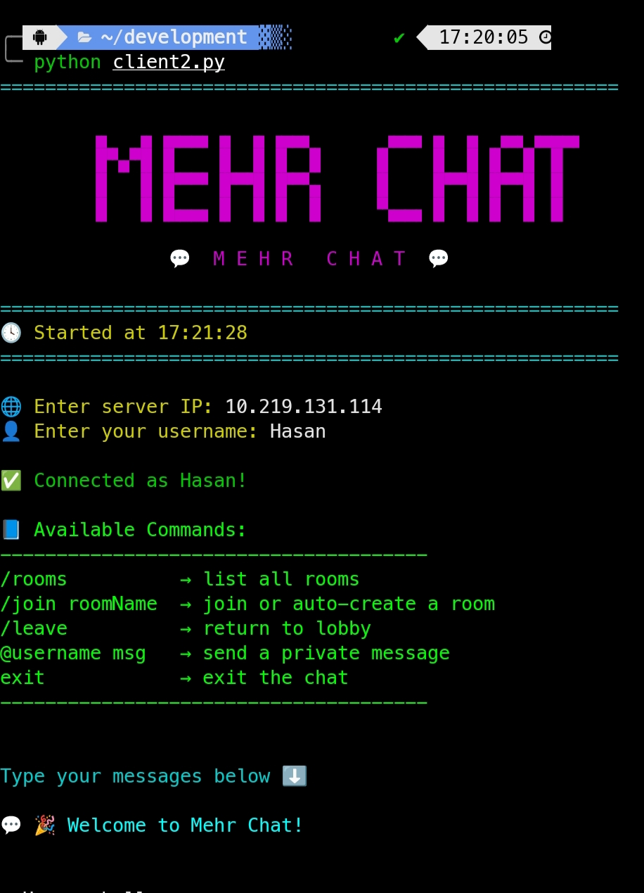

# 💬 MehrChat — Python Socket Chat

یه چت‌سرور ساده و جذاب با Python که چند تا کاربر می‌تونن هم‌زمان با هم چت کنن، روم بسازن و پیام خصوصی بفرستن! 😎🔥


این پروژه شامل دو فایل هست:

* `server.py` → اجرای سرور
* `client.py` → اجرای کلاینت‌ها

همه‌چیز با **TCP socket** کار می‌کنه و ظاهر ترمینال با **Colorama** خوشگل شده 🎨

---

## ⚡ ویژگی‌ها

* چت هم‌زمان چند کاربر با Thread 💻
* رنگ‌بندی جذاب با Colorama 🎨
* نمایش اتصال/قطع شدن کاربران 🟢🔴
* **سیستم روم/کانال**: هر کاربر می‌تونه به روم‌های مختلف بره و فقط تو روم خودش پیام بده 🏠
* **پیام خصوصی (Private Message)**: پیام مستقیم به کاربر دیگه ارسال کن 💌
* دستور `/rooms` برای دیدن لیست روم‌ها
* دستور `/join room_name` برای ساخت یا ورود به روم
* دستور `/leave` برای برگشت به روم اصلی (lobby)
* سازگار با Windows, Linux, Termux 📱

---

## 📦 نصب و راه‌اندازی

### 1️⃣ کلون کردن پروژه

```bash
git clone https://github.com/Mehr-code/mehr-chat.git
cd mehrchat
```

---

### 2️⃣ ساخت محیط مجازی

```bash
python3 -m venv .venv
source .venv/bin/activate     # روی لینوکس/مک

# یا
.venv\Scripts\activate        # روی ویندوز
```

---

### 3️⃣ نصب پکیج‌ها

```bash
pip install -r requirements.txt
```

(فقط یک پکیج لازم داریم: **colorama**)

---

## 🚀 اجرای سرور

```bash
python server.py
```

بعد از اجرا، اطلاعات زیر رو می‌بینی:

* ساعت شروع
* IP لوکال
* پورت سرور
* تعداد کاربران متصل

برای خاموش کردن سرور:

```
shutdown
```

یا:

```
exit
```

---

## 💻 اجرای کلاینت

```bash
python client.py
```

کلاینت ازت اینارو می‌پرسه:

1. **IP سرور**
2. **نام کاربری**

بعدش وارد چت می‌شی 😄💬 و می‌تونی از این دستورات استفاده کنی:

* `/rooms` → لیست روم‌ها
* `/join room_name` → ورود یا ساخت روم
* `/leave` → برگشت به **lobby**
* `@username message` → ارسال پیام خصوصی به کاربر دیگه
* `exit` → خروج از چت

---

## 🌐 اتصال از طریق گوشی (Termux)

1. لپ‌تاپ رو هات‌اسپات کن یا گوشی رو هات‌اسپات کن
2. IP دستگاهی که سرور روش اجرا شده رو داخل کلاینت وارد کن
3. پورت همون 5000 هست

مثال:

```
Enter server IP: 192.168.1.12
```

---

## 📁 ساختار فایل‌ها

```
.
├── server.py
├── client.py
├── requirements.txt
└── .gitignore
```

---

## 🤝 مشارکت

اگه خواستی فیچر جدید اضافه کنیم (لیست کاربران، رمزگذاری End-to-End، نسخه وب‌سوکت، GUI و...) فقط بگو ✨😎

---

## 🧡 سازنده

ساخته شده با عشق توسط **Mehran** ✌️🔥

